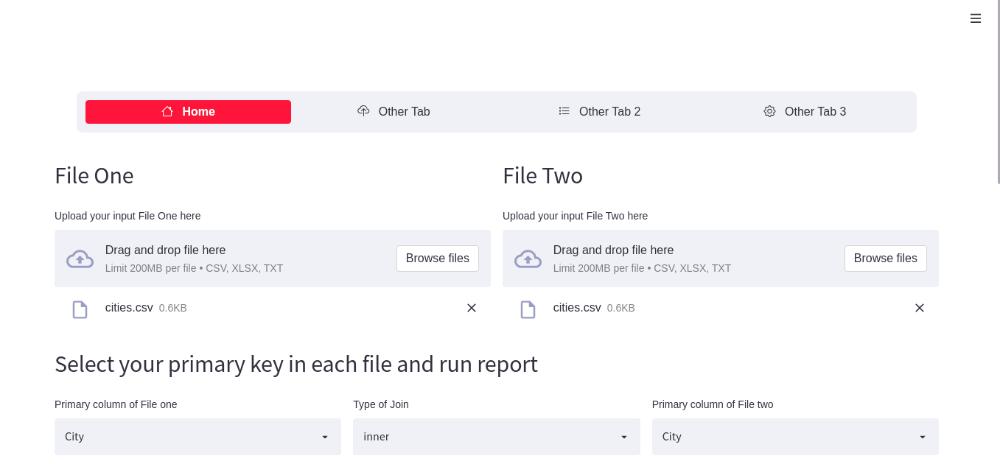
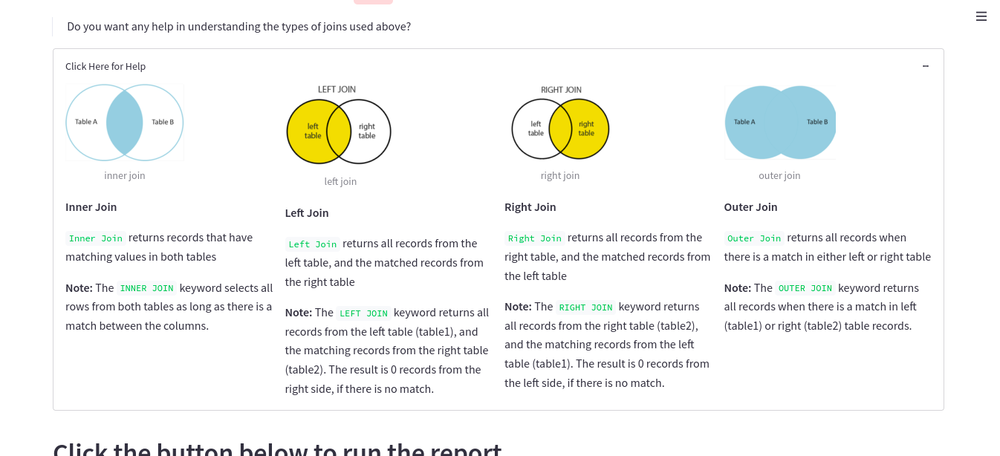
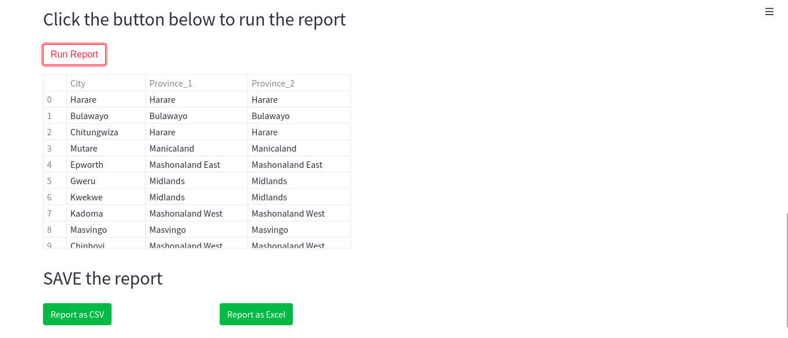

# VLOOK-UP-WITH-STREAMLIT-PANDAS

[](https://share.streamlit.io/ronald55/scrapping-news-data/main/main.py)

#### What is VLOOK UP?
[VLOOK-UP](https://share.streamlit.io/ronald55/vlook-up-with-streamlit-and-pandas/main/main.py) stands for ‘Vertical Lookup’. It is a function that makes Excel search for a certain value in a column (the so called ‘table array’), in order to return a value from a different column in the same row. This article will teach you how to use the VLOOKUP function.

Streamlit is an open-source 
Python library that makes it easy to create and share beautiful,
custom web apps for machine learning and data science. In just a few minutes you can build and deploy powerful data apps.
[Streamlit Docs](https://docs.streamlit.io/library/get-started)

#### To install relevant packages
Open your shell or terminal and install the relevant packages using the command below

```python
pip install -r requirements.txt
```

#### To run this Application
Open the root folder of the project and run the command below:
```python
streamlit run main.py
```

#### Dashboard Example: 
Click [Here](https://share.streamlit.io/ronald55/vlook-up-with-streamlit-and-pandas/main/main.py) to view the demo





